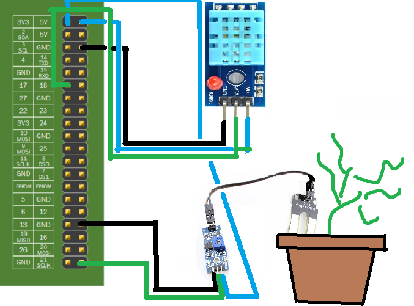
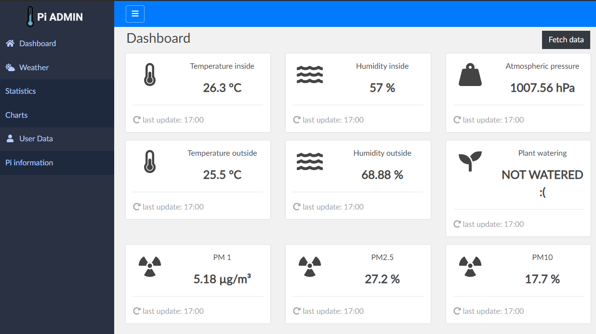
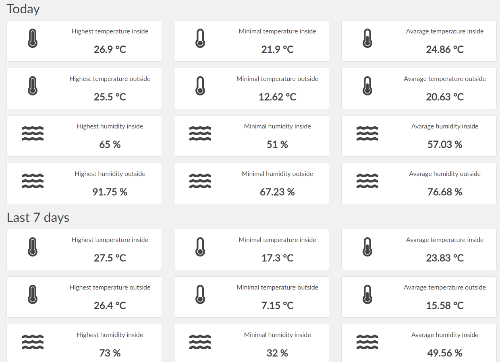
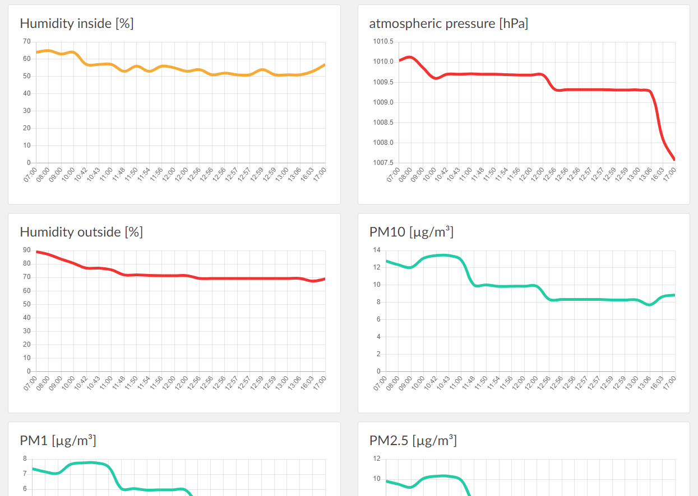
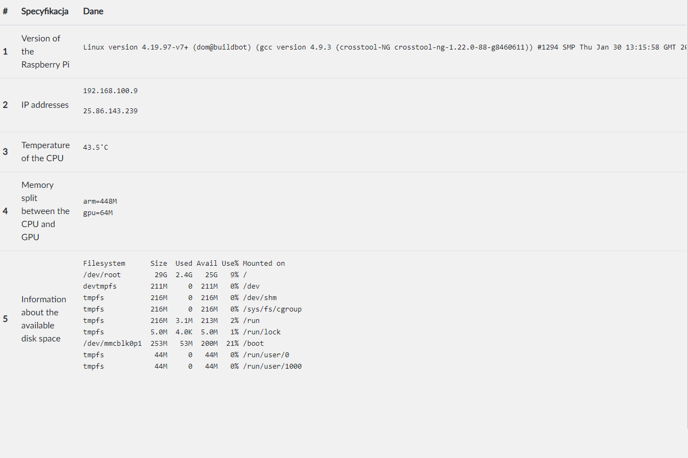
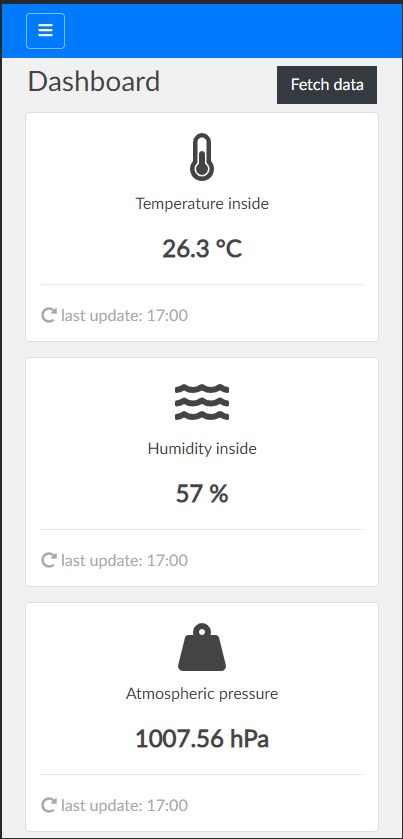
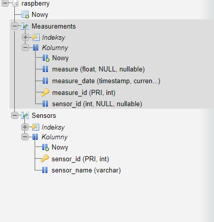

# Project sensor
-----
## 1. Autorzy

Adam Palęga, Łukasz Stasiak

## 2. Spis komponentów 
---
- Raspberry pi 3a+
- Zasilacz 5V
- Karta micro sd 32GB
- Czujnik temperatury i wilgotności dht11
- Czujnik wilgotności gleby
- Kable do potrzebne do podłączenia czujników
## 3. Wykorzystane technologie
---

* [HTML](https://devdocs.io/html/) 
* [Bootstrap](https://getbootstrap.com/docs/4.5/getting-started/introduction/) 
* [JavaScript](https://devdocs.io/javascript/t) 
* [PHP](https://www.php.net/docs.php) 
* [Python 3](https://docs.python.org/3/) 
* [MySQL](https://dev.mysql.com/doc/)
* [Serwer Apache](https://httpd.apache.org/)

## 4. Funkcjonalności
----

- Automatyczny pomiar temperatury co godzinę zapisywany do bazy danych.
- Automatyczny pomiar wilgotności co godzinę zapisywany do bazy danych.
- Automatyczny pomiar ciśnienia co godzinę zapisywany do bazy danych.
- Automatyczny pomiary wilgotności gleby rośliny i przypominanie o konieczności podlania.
- Historia pomiarów w postaci wykresów.
- Automatyczne co godzinę pobieranie danych z zewnętrznego api w celu wyświetlania informacji na temat jakości powietrza.
- Wyświetlanie statystyk z dnia, oraz tygodnia na podstawie pomiarów przechowywanych w bazie danych.
- Możliwość wykonania pomiaru za pomocą przycisku.
- Dane na temat Raspberry Pi w zakładce User Data.

## 5. Schemat podłączenia czujników
---

## 6. Screeny z aplikacji oraz bazy danych
---
* Strona główna

* Statystyki

* Wykresy

* Informacje o systemie

* Werjsa mobilna  

* Baza danych 

## 7. Użyty kod zewnętrzny
---
* [DHT-11](https://github.com/szazo/DHT11_Python)
* [BootStrap Template](https://github.com/alexis-luna/bootstrap-simple-admin-template)

